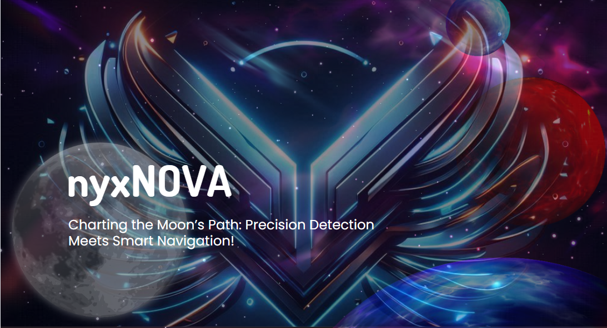

### *nyxNOVA merges cutting-edge lunar cartography with intelligent rover navigation, paving the way for next-generation lunar exploration. Our solution harnesses the power of AI to decode the moon's enigmatic terrain and chart safe passages for future missions.*

## 🌟 Key Features

### Celestial Sentinel
Our AI-powered lunar detective scans the lunar surface, unveiling hidden craters and boulders with unprecedented precision.

### Cosmic Pathfinder
Crafting safe routes through the moon's treacherous south polar region, our navigation system ensures rovers can traverse the lunar landscape with confidence.

### Lunar Laboratory
Strategic pit stops for scientific exploration are seamlessly integrated into our navigation plans, maximizing the scientific yield of each mission.

## 🛠 Tech Stack

- State-of-the-art neural networks
- Advanced graph-based algorithms
- High-resolution lunar datasets

## 🌓 Join the Lunar Revolution

Interested in contributing to the future of space exploration? Check out our [CONTRIBUTING.md](CONTRIBUTING.md) to get started!

Project Link: [https://github.com/yourusername/nyxNOVA](https://github.com/stardust-crusaders-x/nyxNOVA)

---

*"That's one small step for a rover, one giant leap for lunar exploration."* - nyxNOVA Team
