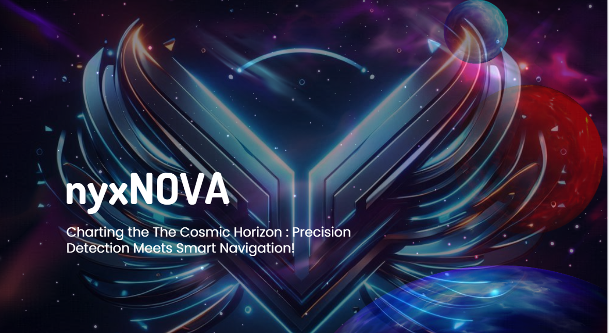

### *"nyxNOVA merges cutting-edge exoplanet cartography with intelligent navigation, paving the way for next-generation cosmic exploration. Our solution harnesses the power of AI to decode the cosmo's enigmatic terrain and chart safe passages for future missions."*

### Features:

 - Celestial Sentinel: Our AI-powered cosmic detective scans the exoplanet surface, unveiling hidden craters and boulders with unprecedented precision.
 - Cosmic Pathfinder: Crafting safe routes through the cosmo's treacherous regions, our navigation system ensures rovers can traverse the any landscape with confidence.
 - Cosmic Laboratory: Strategic pit stops for scientific exploration are seamlessly integrated into our navigation plans, maximizing the scientific yield of each mission.

## Installation

### Prerequisites

- Python 3.8+
- Node.js 14.x or later
- npm

### Backend Setup

1. Clone the repository:
   `git clone https://github.com/stardust-crusaders-x/nyxNOVA.git
      cd nyxNOVA-be`

3. Set up a virtual environment:
   `python -m venv venv
source venv/bin/activate  # On Windows use venv\Scripts\activate`
4. Install required packages:
   `pip install -r requirements.txt`
   or
   `pip install pqdict segmentation_models_pytorch`
   `pip install pytorch-lightning`
   `pip install torch`
### Frontend Setup

1. Navigate to the frontend directory:
   `cd nyxNOVA-fe`
 `exoplanet charting: cd Exoplanet\Atmos_tut\r3f-wawatmos-starter`
3. Install dependencies:
  `npm install` `yarn install`
4. Run the development server:  
  web ~ ``cd nyxNova-site
            npm run dev``
  sim ~ ``cd MoonLander-Simulator``
   ed ~ ``cd Exoplanet\Atmos_tut\r3f-wawatmos-starter
           yarn dev``
  

Project Link: [https://github.com/stardust-crusaders-x/nyxNOVA](https://github.com/stardust-crusaders-x/nyxNOVA)

*"One small step for a cosmo, one giant leap for space exploration."* 
— The nyxNOVA Vanguard

